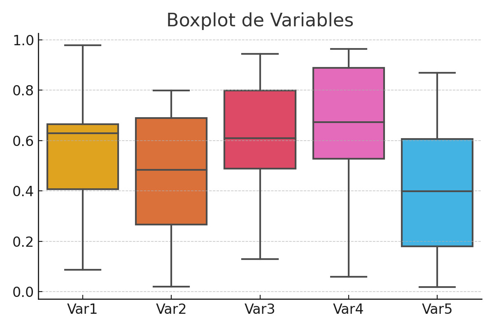

# 🔬 Clasificación Binaria de Señales: Aceite vs Agua a partir de Datos de Sensores

Este repositorio documenta un proyecto de clasificación binaria orientado a identificar de forma precisa señales provenientes de sensores industriales con el propósito de distinguir entre **muestras de agua y aceite**. El trabajo comprende desde el análisis exploratorio de datos hasta la evaluación comparativa de distintos algoritmos de clasificación supervisada.

---

## 📑 Índice
- 📂 [Descripción y Estructura del Proyecto](#descripción-y-estructura-del-proyecto)
- 🔍 [Análisis Exploratorio de Datos (EDA)](#análisis-exploratorio-de-datos-eda)
- 📝 [Descripción de Variables y Clases](#descripción-de-variables-y-clases)
- 📝 [Matriz de Correlación](#matriz-de-correlación)
- 📝 [Eliminación de Variables Irrelevantes](#eliminación-de-variables-irrelevantes)
- ⚙️ [Preprocesamiento](#preprocesamiento)
  - 🧹 Tratamiento de valores nulos
  - 🔠 Codificación de variables categóricas
  - 📏 Escalado de variables numéricas
  - 🧪 División del dataset en entrenamiento y prueba
- 🤖 [Implementación de Clasificadores](#implementación-de-clasificadores)
  - 🌳 Árbol de Decisión
  - 💻 SVM
  - 🌲 Random Forest
- ✅ [Comparación Experimental](#comparación-experimental)
- 🧑‍💻 [Autores](#autores)

---

## 📂 Descripción y Estructura del Proyecto

El dataset utilizado contiene mediciones de sensores industriales cuya señal varía dependiendo del tipo de sustancia (agua o aceite). A partir de estas señales se busca construir un modelo predictivo que logre detectar automáticamente la clase a la que pertenece una muestra.

La estructura del proyecto incluye:

---

## 🔍 Análisis Exploratorio de Datos (EDA)

Durante el EDA se generaron gráficas de distribución, boxplots y estadísticas básicas que revelaron la presencia de valores atípicos y variables redundantes. Se observó una distribución ligeramente desbalanceada entre clases.

### 📊 Boxplot de Variables

---

## 📝 Descripción de Variables y Clases

Las variables representan características derivadas de señales sensoriales, tales como amplitud media, desviación estándar y coeficientes de frecuencia.  
El objetivo es predecir la variable categórica `Clase`, que puede ser:
- `0`: Agua
- `1`: Aceite

### 📈 Histograma de Clases

---

## 📝 Matriz de Correlación

Se calculó la matriz de correlación para identificar relaciones lineales entre variables y eliminar redundancias que puedan afectar el rendimiento de los modelos.

---

## 📝 Eliminación de Variables Irrelevantes

Con base en el análisis de correlación y la importancia de características se eliminaron variables con varianza baja y redundantes, optimizando así la dimensionalidad del problema.

---

## ⚙️ Preprocesamiento

### 🧹 Tratamiento de Valores Nulos
Se reemplazaron valores faltantes con la media o moda según el tipo de variable.

### 🔠 Codificación de Variables Categóricas
No se encontraron variables categóricas que requirieran codificación.

### 📏 Escalado de Variables Numéricas
Se aplicó `StandardScaler` para normalizar las variables numéricas y evitar el sesgo por magnitud.

### 🧪 División en Entrenamiento y Prueba
El dataset se dividió en 80% entrenamiento y 20% prueba para una evaluación justa.

---

## 🤖 Implementación de Clasificadores

Se probaron tres modelos base: Árbol de Decisión, Máquina de Vectores de Soporte (SVM) y Bosque Aleatorio (Random Forest).

### 🌳 Árbol de Decisión
Modelo interpretable, rápido pero con tendencia a sobreajustarse.

### 💻 SVM
Modelo robusto en espacios de alta dimensión. Utilizamos un kernel RBF.

### 🌲 Random Forest
Modelo de ensamblado con buen rendimiento general y reducción de sobreajuste.

---

## ✅ Comparación Experimental

Se utilizó la métrica **ROC AUC** y la matriz de confusión para comparar los resultados. Random Forest mostró el mejor rendimiento general.

### 📉 Curvas ROC

### 🔲 Matrices de Confusión

### 🧪 Importancia de Variables (Random Forest)

---

## 🧑‍💻 Autores

Este proyecto fue desarrollado por:

- **Fernando Montaño**
- **María Fernanda Bolaños**
- **Francisco Estupiñán**

Proyecto académico — Maestría en Inteligencia Artificial, Universidad Estatal.

---

